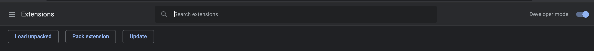
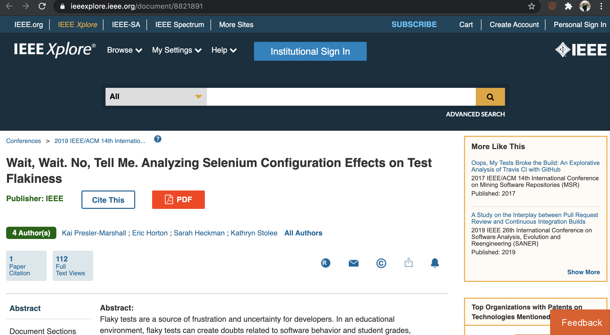
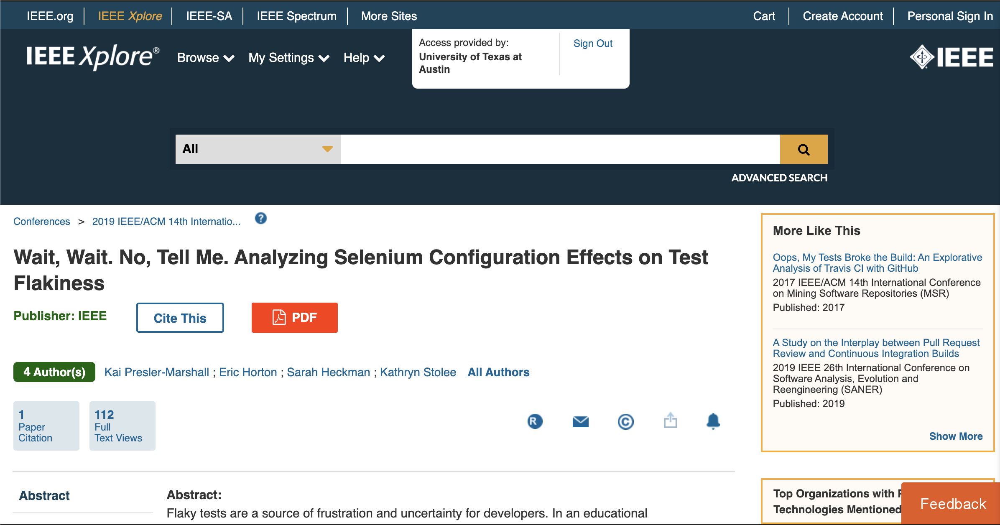

This is a chrome extensions for UT students to quickly have access to free papers with UT accounts.

## How to install:     

1. Download and unzip the file (UTLibrary.zip)
https://drive.google.com/file/d/1Dxrw7FvwffnQmoXu7ICjqpkwqLc5IvNp/view?usp=sharing

2. Go to chrome://extensions/    
Choose "Load Unpacked"

## How to use:

1. pin extension

2. Open a webpage which requests access

3. Click the icon of UTLibraryAccessor. It would redirect you to the UT account login page and then you can download the paper for free!

